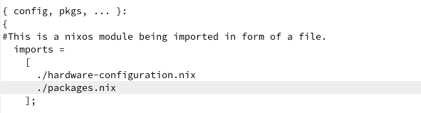

# 
Project Proposal
# Create nix derivations for Regolith Linux

\+

## **Organisation  : CCExtractor**
## **Mentor 	           : Soumya Ranjan Patnaik**
## **Applicant           : Sandeep Patel**
## **CONTACT INFORMATION**
**NAME**	: Sandeep Patel

**EMAIL**	: sandeeppatel626735@gmail.com

**GITHUB**	: [sandptel](https://github.com/sandptel)

**LINKEDIN**	: [sandppatel](https://www.linkedin.com/in/sandppatel/)

**LOCATION**	: Kharagpur, West Bengal, India

**TIMEZONE**	: IST( UTC + 5:30)
## **STUDENT AFFILIATION**
**UNIVERSITY**	: [Indian Institute of Technology Kharagpur](https://www.iitkgp.ac.in/)

**DEGREE**	: Dual Degree Course (B.Tech + M.Tech)

**MAJOR**	: Mechanical Engineering

**EXPECTED GRADUATION**	: 2026
## **BRIEF BIO**
I am Sandeep Patel, a third-year undergraduate student at IIT Kharagpur, deeply passionate about technology, particularly Linux development. My journey with Linux, especially NixOS, has been enriching and educational. Over the past year, NixOS has been my primary operating system, allowing me to explore various features such as flakes, shell.nix, and the intricacies of system configuration and module development. Despite my explorations, I've often felt that I've only scratched the surface of what NixOS offers. My curiosity and desire to delve deeper into the system's capabilities have led me to undertake a challenging yet exciting project: integrating the Regolith desktop environment with NixOS. This project represents a significant step beyond my usual activities, pushing me to expand my knowledge and technical skills. My motivation for this project is not just to enhance my understanding of NixOS but also to contribute meaningfully to the community. 

# **Project Description**
## **Overview**
The project aims to integrate Regolith Linux, a modern desktop environment built on top of GNOME with i3-wm, into NixOS, a Linux distribution with a declarative and reproducible configuration model. The goal is to enable NixOS users to install and configure the Regolith desktop environment easily through Nix expressions, providing a seamless and customizable user experience.
## **Technical Background**
### **About Nix and Nixos**
**Nix** is the package manager at the heart of NixOS, but it can also be used independently on other Unix-like operating systems, such as Linux and macOS. It is designed to offer reproducible and declarative package management.

**NixOS** is a Linux distribution with a unique approach to system configuration and package management. NixOS is configured through a single, declarative configuration file (configuration.nix), which specifies the entire system configuration, including installed packages, system services, and user settings. 

**Nixpkgs** is the official repository containing a collection of over 60,000 packages and NixOS modules, which constitute the Nix Packages collection. It serves as the primary source of packages and system configurations for users of the Nix package manager and NixOS.

**Nix package/Nix derivation** is defined in a file (typically called a Nix expression) that specifies how to build the package from its source code.

**Nixos Modules** are nix expressions that enclose configuration options, system settings which rather would rather have been written in raw form inside the configuration but instead its written in a separate file and the file is imported in configuration.nix file making the config more modular and easy to manage.

**Nixos Option** is simply a module that has been ported to [nixpkgs official modules](https://github.com/NixOS/nixpkgs/tree/nixos-23.11/nixos/modules).

So the underlying module is imported hasslefree directly with one liner expressions. 

The configuration.nix file is composed of [Nixos Options](https://search.nixos.org/options) like these for the bootloader and many other system settings.

**Other Points About Nix** 

1. The derivations when being installed are sandboxed and cannot change system-level files and settings. (No sudo commands when building )
1. Nixos does not store binaries in **/bin** and **/usr/bin** but they are stored at **/nix/store** with the folder names as “<package\_specific\_hash><package\_name><package\_version>”.

   Ensuring that multiple versions of the same package can exist in a single system.

**About Regolith Desktop**

Regolith Desktop is a modern desktop environment that combines the efficiency of a tiling window manager with the convenience of a full-featured desktop. It's built on top of Ubuntu/Debian and uses i3-wm/sway as its core window manager, providing a minimalist and efficient interface. Key components of Regolith include the Regolith Ilia menu system, i3xrocks (a status bar), GNOME Flashback for session management etc.

**For this project I will be porting [Regolith Desktop Release 3.1 Ubuntu-mantic](https://github.com/regolith-linux/voulage/blob/main/stage/release-3_1/ubuntu/mantic). And would replicate the experience of this specific release for Nixos.**
### **Why Should Regolith be Ported to Nix?**
NixOS's declarative configuration and reproducible build processes ensure that Regolith can be installed and run in the exact same state across different machines or environments. This reproducibility minimises "*it works on my machine"*  issues and enhances reliability. 

**Immutability** - Also porting any software to nix means one can declaratively create a copy of his system without running multiple commands or copying files. All of this is just kilobytes sized configuration.nix without any mutations.

**Easy Reproducibility** - Setting Up you custom Desktop Environment in Nixos is as easy as copying a bunch of lines of nix expressions to the configuration.nix file. Therefore replicating Regolith on Nixos Provides users to Install and Manage their Regolith System without the burden of Reconfiguring everything again and again.

This is an example of Heavily Customised [Hyrpland Setup](https://github.com/Aylur/dotfiles/tree/ags-pre-ts) all written in a single flake.nix file which can be used to reproduce the exact system on any desktop.

**Easy RollBacks :** Nixos Provides easy rollbacks if anything goes wrong along with which it maintains Generations of the Configuration file also ensuring that the exact system is being built on each and every iteration.
## **Final Goal** 
***“”** I'd say the "end goal" would be a services.xserver.desktopManagers.regolith.enable that, when enabled, configures a mostly working-as-intended regolith desktop. Just like services.xserver.desktopManager.gnome.enable does the same for GNOME.**””** ~* is described as the final goal mentioned in this [issue](https://github.com/regolith-linux/regolith-desktop/issues/604#issuecomment-1049407657) and is the most sensible final outcome of such a project.

services.xserver.desktopManagers.regolith.enable, the enable part is called a Nixos option. This particular option is a boolean flag that can be used to activate or deactivate the Regolith desktop manager within the NixOS configuration.

Here is an example of configuration that [enables i3](https://search.nixos.org/options?channel=23.11&from=0&size=50&sort=relevance&type=packages&query=i3) along with providing a list of extra packages and configFile to install along with it …

The fundamental principle or crux of NixOS is its capacity to ensure near-perfect reproducibility, which is achieved through extensive modularity. In NixOS, users can specify their desired software components as daemons for various functions and can seamlessly integrate their personal configurations and setups. With this philosophy, I aim to add a [high degree of modularity into the Regolith Nix Module](#_cypp0zk0emag), ensuring that users have the flexibility to customise their setups in a detailed manner.

# **PLAN OF ACTION**
## **Phase 1: Making Core Components Available to Nixpkgs**
Phase 1 would be creating nix derivations for the core components of Regolith first to provide a basic Regolith like experience. For creating those derivations I would follow the following steps….

- **Analysing  Components**: I will start by thoroughly analysing each component of [Regolith-desktop 3.1](https://github.com/regolith-linux/voulage/blob/main/stage/release-3_1/ubuntu/mantic/package-model.json), understanding its functionality, dependencies, and integration points with the rest of the environment.
- **Environment Preparation**: Set up a development environment specifically for Nix package creation using a nix tool called *shell.nix*  which on performing  [$nix-shell ](https://nixos.wiki/wiki/Development_environment_with_nix-shell)makes all the specified packages available to the shell for the session only. 
- **Build and Install Phases**: Define custom build and installation steps if the default Nix behaviour does not suffice, ensuring each application is correctly compiled and installed within the Nix environment.

  ` `In this phase the most time taking work is PostInstall Hook for specific application requirements. 

  For Example in derivation of ilia copying [Gsettings Schemas](https://github.com/regolith-linux/ilia/blob/main/meson.build#L27C24-L27C32) and Compiling is a part that required sudo commands for full system installation, but It needs to be adjusted by[ creating a wrapper ](https://ryantm.github.io/nixpkgs/languages-frameworks/gnome/#ssec-gnome-common-issues-missing-schema)around the executable to provide it the schema in case of Nixos as all the files are stored within /nix/store only. 

  

[Link Previews](https://github.com/regolith-linux/voulage/blob/main/stage/release-3_1/ubuntu/mantic/package-model.json) **: List of Applications required to be ported to nixpkgs**

1. [Regolith-Session](https://github.com/regolith-linux/regolith-session)
1. [Regolith-Sway](https://github.com/regolith-linux/regolith-sway)
1. [Regolith-wm-config](https://github.com/regolith-linux/regolith-wm-config)
1. [trawl](https://github.com/regolith-linux/trawl)
1. [Regolith-inputd](https://github.com/regolith-linux/regolith-inputd)
1. [Regolith-displayd](https://github.com/regolith-linux/regolith-displayd)
1. [Regolith-powerd](https://github.com/regolith-linux/regolith-powerd)
1. Regolith-look
1. [Ilia](https://github.com/sandptel/tasks/tree/main/ilia) ✅
1. [gtklock](https://search.nixos.org/packages?channel=23.11&from=0&size=50&sort=relevance&type=packages&query=gtklock)  ✅
1. [rofication-daemon](https://github.com/sandptel/tasks/tree/main/rofication) ✅
1. [i3status-rust](https://github.com/regolith-linux/regolith-i3status-rust)
1. Remontoire ✅

All these applications are an integral part of the base regolith-desktop which I am taking as starting packages to be ported to Nixos. Some of the checked ones (i3-wm, gtklock) are available on nixpkgs.

I have made  derivations for **Ilia, Lago, Rofication, Remontoire** among which building the derivations of Ilia and Rofication was the qualification task. [Link Previews](https://github.com/sandptel/tasks)

**Testing** :  I will then test all of these programs on an isolated Nixos VM on both i3 and sway Window Managers. Also Verify their build Integrity and ability to work alongside each other.

**Publishing** :  I will be creating Pull Requests to the official nixpkgs repository for publishing my derivations on the official nixpkgs for easy access of these derivations while creating Modules using them.

**Phase 1 Goals :**

1. Develop Nix derivations for each of the core components.
1. Test the core components individually and collectively to ensure that they function correctly on NixOS.
1. Release the initial version of these components to the community/nixpkgs for feedback.
## **Phase 2: Loading Configs/Creating Nix Module**
The first step before creating the module would be to load up config files required for Regolith to work. Here’s how Regolith currently handles configurations:

1. **GNOME Integration:** Regolith leverages GNOME for system settings, theming, and notifications. It uses GNOME's configuration system (gsettings or dconf) to manage these aspects.

   **Solution :** For these types of configurations, there already exists a [fix](https://ryantm.github.io/nixpkgs/languages-frameworks/gnome/#ssec-gnome-common-issues) addressed by nixpkgs itself to create a wrapper for the executable and mention the required parameters along with it, which I have used to create derivation for ilia. [Link Previews](https://github.com/sandptel/tasks/blob/2ae9cf86c0f9235678e906ca7de05cd2a3b98424/ilia/default.nix#L40C1-L40C84)

1. **i3 Configurations:** At its core, Regolith uses the i3/sway window manager. Therefore, it loads configurations from files like ~/.config/i3/config or the system-wide configuration in /etc/i3/config.
1. **Regolith-Specific Configurations:** Regolith introduces additional configurations, such as its own look-and-feel settings, managed through a combination of i3 configuration files and Regolith-specific settings.
1. **Xresources and Theming:** Regolith extensively uses Xresources for theming, which allows users to change the look of the desktop environment by altering the .Xresources file or the Regolith-specific configurations in ~/.config/regolith/styles.

**Approach :** I would be using either of these 2 mentioned ways to load up the configs (i3 configurations, Regolith-Specific configurations, Xresources and Theming).

1. **Home Manager Configs**

   Home Manager is a tool for managing the user environment using Nix, handles dotfiles by allowing users to define the desired state of their home directory's configuration files (dotfiles) in a declarative manner.

   Home Manager uses a file called home.nix to manage the user's environment and configurations. You can edit this file to specify your dotfiles and other configurations. Home manger based configs are extremely modular and can be configured to specify load every required user level config even from a github repository in real time. [Example - Hyprland Setup](https://github.com/Aylur/dotfiles/tree/ags-pre-ts)

   This is the example layout of a home.nix configuration 

|
{ config, pkgs, ... }: { `  `# Manage the bash configuration `  `programs.bash = { `	`enable = true;

`      `# These options are modules described in home manager itself `	`profileExtra = '' `  	`# Custom bash configuration here `	`''; `  `}; `  `# Managing Vim configuration `  `programs.vim = { `	`enable = true; `	`settings = { `  	`# Vim settings go here `	`}; `  `}; `  `# Using Home Manager to directly manage dotfiles `  `home.file.".vimrc".source = "/path/to/dotfiles/.vimrc"; `  `home.file.".bashrc".source = "/path/to/dotfiles/.bashrc"; }
|
| :- |
||

**Disadvantages of Home Manager :**

1\. Home Manager provides a declarative approach but is focused too much on only the user level.

2\. Home Manager is not by default integrated in the Nixos Ecosystem by default and needs to be installed manually and at least requires an extra step of settling home.nix file to correct location. Which is absolutely Not a step we want to include while [final installation of  Regolith-Desktop](#_8g3a93jdql7x). 

Also, during the [learning phase](#_2wlad9qmnijy) I will be exploring more on the feasibility of automating the installation of configs and home-manager.

1. **environment.etc functions**

   The environment.etc function in NixOS is for managing system-wide configuration files. It allows users to declaratively specify files that should be placed in /etc, ensuring that system configurations are consistent and reproducible across NixOS installations. This is particularly helpful for daemon configurations, system-wide settings, and other files that need to be globally accessible. 

|{ config, pkgs, ... }: { `  `environment.etc."myconfig.conf".source = pkgs.my-config-files + "/etc/myconfig.conf"; } #This will symlink myconfig.conf file into /etc/myconfig.conf.|
| :- |

**Disadvantages :** 

The environment.etc function in NixOS is specifically designed to manage system-wide configuration files located in the /etc directory, which affects all users on the system. It's not suited for managing user-level files, therefore the application of Xresources files used by regolith for theming could not be implemented the usual way.

Again exploring both home-manager and environment.etc will be done by me in the learning  phase and I would figure out which one or both should be used for loading up config files to the system.

Next step includes me going through the [Nixos Modules Documentation](https://nixos.wiki/wiki/NixOS_modules) as well as example Modules from the nixos repository extensively and figuring out each of the upcoming steps and challenges on the way.

Still this is the vague Idea of steps required for its completion ..

- **Define Module Options:** In the module, I would define options that users can set to customise the Regolith environment. For a basic functioning project this option would Include a Basic Enable Option initially.

|{ lib, ... }: { `  `options.services.regolith = { `    `enable = lib.mkEnableOption "Regolith Desktop Environment"; `    `# Other options as needed `  `}; }|
| :- |

- **Implement Configuration Logic:** Inside the module, I will be using the config attribute to implement the logic that configures the system based on the options set by the user. This might involve setting environment variables, managing system packages, configuring systemd services, and ensuring the necessary files and directories are in place.

|{ `  `config = lib.mkIf config.services.regolith.enable { `    `# System configuration for Regolith `    `environment.systemPackages = [ /\* required packages \*/ ];      `    `# System services and other configurations `    `# systemd.services = { ... }; `  `}; }|
| :- |

- **Manage Files and Services:** Will be using NixOS features like environment.etc to manage configuration files and systemd.services to handle service management. This ensures that Regolith’s components are integrated with the system’s startup and management processes.

- **Pushing Nixos Option on official nixpkgs**

  Creating a final Nixos Module would include me going through all of the [contributing guidelines](https://github.com/NixOS/nixpkgs/blob/master/CONTRIBUTING.md) of the official nixpkgs repository and also adjusting all created derivations and Module settings to ensure reproducibility.

  **Phase 2 Goals :**

1. Create a fully functional NixOS module to enable and configure the Regolith desktop environment through NixOS configuration.
1. Figureout and create any scripts or tools needed to integrate Regolith components with NixOS, such as for managing configuration files or systemd service files.
## **Phase 3: Creating CI/CD Workflows for Nixos Version**
To set up CI/CD workflows on GitHub Actions for building and testing Regolith packages against various NixOS versions I would require to learn and setup tools like [Cachix](https://www.cachix.org/) and [Hydra](https://nixos.wiki/wiki/Hydra) for Building Regolith Desktop.

There is already [Voluage](https://github.com/regolith-linux/voulage) which holds configuration to build packages for new versions of Regolith (Ubuntu and Debian versions). I would add new files and Set up CI pipelines to automatically build and test the packages against various NixOS versions to catch compatibility issues early.

Though I would be taking time to learn about both Github Actions as well as nix testing tools. I have an action plan which I feel would be more or less the same throughout…

1. **Define Build Workflow:**
   1. I would be creating a build.yml to define steps to check out the code, set up the Nix environment, and build the Regolith packages.
   1. Use the actions/checkout and cachix/install-nix-action actions for checking out the code and setting up Nix.
   1. Would define a matrix strategy to build against different NixOS versions (specifically nixos-unstable, nixos-23.11 ) if necessary.
1. **Integration with Voluage:**
   1. Integrate the existing Voluage configuration into your CI/CD pipeline.
   1. Use cachix/cachix-action in GitHub Actions to cache the build outputs and speed up the CI/CD process.
   1. Configure Cachix to share Nix store paths between workflow runs and between developers.

**Phase 3 Goals :**

1. Gain a comprehensive understanding of GitHub Actions, Cachix, and Hydra, focusing on their integration and usage in NixOS environments.
1. Create and configure GitHub Actions workflows (build.yml, test.yml) for building and testing Regolith packages.
1. Create comprehensive documentation on the CI/CD setup, including how to manage and update the workflows and handle build failures.
# **TIMELINE**
### **Learning Phase (3 weeks)**
- **Week 1-2 :** Learning more about packaging different softwares using nix. Reading [Documentation](https://ryantm.github.io/nixpkgs/languages-frameworks/python/) /actual nixpkgs derivations code to learn about creating complex nixpkgs.
- **Week 2-3 :** Learning about various parts of Regolith-Desktop and Nixos Modules too. And clarifying the exact process of Applying configurations to the final. 
  ### **Phase 1 (4 weeks) :**
- **Week 3-5:** Develop Nix derivations for the remaining  of the core components. 
- **Week 5-6:** Test the core components individually and collectively to ensure that they function correctly on NixOS. 
- **Week 6-7:** Release the initial versions of derivations to the community for feedback. Also create pull requests to the official nixpkgs repository. Also getting familiar with the documentation for making contributions regarding both nixpkgs and Nixos Modules.
  ### **Phase 2 (3 weeks) :**
- **Week 7-8 :**  Figureout and create any scripts or tools needed to integrate Regolith components like Config files with NixOS.
- **Week 8-10 :** Create a fully functional NixOS module to enable and configure the Regolith desktop environment through NixOS configuration.
  ### **Phase 3 (2 weeks) :**
- **Week 10-12 :** Create and configure GitHub Actions workflows (build.yml, test.yml) for building and testing Regolith packages. Meanwhile also documenting the CI/CD setup as a developer guide.

### **Commitments**
During weekdays (Monday through Friday), I will be able to dedicate **3-5 hours** to project work, ensuring alignment with Indian working hours. This allows for efficient communication and collaboration.

To compensate for the reduced weekday schedule, I'm happy to invest additional hours on weekends (Saturday and Sunday) – typically **7-8 hours** per day. This extended weekend commitment ensures that I meet the proposed timeline..

### **Additional Information about the Timeline**
- The timeline mentioned above is subject to change and is only an approximate outline of my project work. I will stick to or exceed this schedule and create a more detailed schedule during the pre-GSoC and community bonding phase.
- I've no other commitments during the summer and can dedicate 30 to 35 hours a week. During the last month of the project, my college will begin, and I'll be able to commit a max of 20 a week. Due to the same, I will do a significant portion of the work before this period.
- Time will be divided (according to workload) each week amongst planning, learning, coding, documenting and testing features. All documentation will go hand in hand with the development.
  # **Post GSOC Plans**
1. ## **Creating more Options for Regolith Nix Module**
   Post GSOC I would be working to create multiple regolith specific options to the final regolith nixos options directly. This would make Regolith Config Options more modular for nixos users which is the essence of porting Regolith to Nixos. Having major settings including *notificationDaemon , keybindings , theme etc*  directly editable via the configuration to maintain reproducibility is the most important part of Nixos.

|
services.xserver.regolith = { `  `enable = true; `  `notificationDaemon = "rofication";  `  `theme = "default";  # or 'solarized-dark', 'gruvbox', etc. `  `keybindings = "standard";  # or 'custom', if you want to allow user-defined keybindings

extraPackages = with pkgs; [

`    	`ilia

`      `rofication-daemon

`      `regolith-control-center

`      `lago

      . . .

` 	`]; };
|
| :- |
||
Customising regolith configuration options to this level would not only provide modularity but also solves the bonus point mentioned in [Qualification Tasks](https://ccextractor.org/public/gsoc/2024/nix_regolith/) - 

*“Bonus points if you can make it easy to switch between rofication and dunst.”*
1. ## **For Long Term Support**
   **Documentation :** I would be compiling a comprehensive documentation that would cover installation, configuration and troubleshooting of every derivation I create while also ensuring it's updated with each release. That would help any new developer to understand and make changes to the packages.

   **Community :** Nix and Nixos has an extensive community of enthusiasts developing nixpkgs and maintaining them. Every year they conduct [Summer of Nix](https://summer.nixos.org/) to get people onboard with developing with nix. This Regolith Project could be introduced to such an event to get more developers.

#

